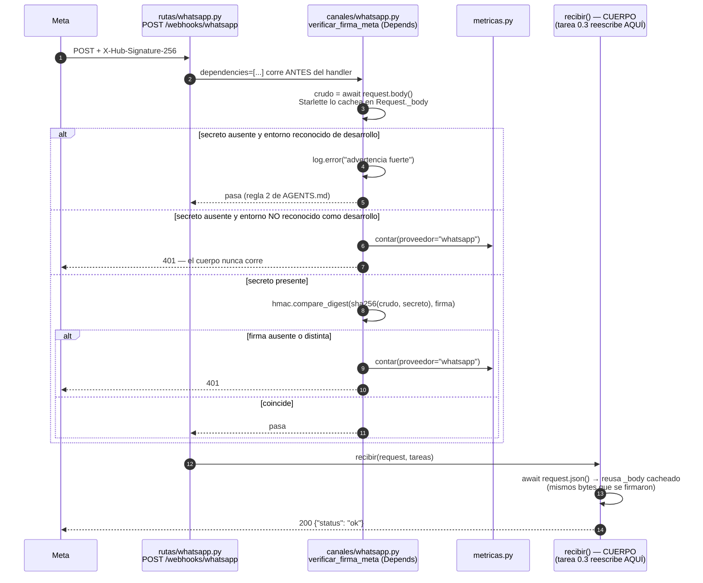

# Diseño — Ola 0: firmas de webhook y filtro de móvil

Fase SDD: `sdd-design` · Fecha: 2026-08-22 · Almacén: openspec · Entrega: un solo PR

Dos bloques sin un archivo en común. **Bloque A (`voz`, Python):** la autenticidad del webhook se
mueve a una dependencia de FastAPI, fuera del cuerpo de `recibir()`. **Bloque B (`core`, TypeScript):**
la compatibilidad móvil–paciente sube de "descarte por sede" a "precondición del caso", y
`evaluateEligibility()` deja de ser código muerto sin poder aflojar el filtro duro.

---

## 1. Bloque A — flujo del webhook de WhatsApp



El `GET /whatsapp` **no** lleva la dependencia: el handshake de Meta no va firmado, se autentica con
`hub.verify_token` (`canales/whatsapp.py:54`).

**El 401 rompe a propósito el "200 SIEMPRE"** del docstring de `rutas/whatsapp.py:6`. Esa regla
existe para que Meta no desactive el canal por *nuestros* bugs; una solicitud que Meta no firmó no es
Meta, así que no hay canal que proteger. El costo real: si el secreto queda mal configurado,
respondemos 401 a Meta de verdad y Meta desactiva el webhook. El detector de ese caso es
`pulso_webhook_firma_invalida_total`, y por eso la métrica no es decorativa.

---

## 2. Bloque B — `rankear()` antes y después

```
ANTES
  rankear(caso, sedes, etas)
    for (const sede of sedes)                             <- linea 202
      faltantes / complejidadOk                              (dependen de la sede)
      movilOk = movilCompatible(caso.tipoMovil, ...)      <- linea 211: N veces, NO depende de sede
      motivoDescarte = ... | 'El paciente requiere medico a bordo (movil TAM)'
    viables = evaluados.filter(motivoDescarte === null)   -> []
  RoutingService.match() -> PULSO_NO_ELIGIBLE_DESTINATION  (ya funciona, routing.service.ts:44)
  Consola de campo: 4 tarjetas grises culpando a 4 hospitales de una condicion del movil

DESPUES
  rankear(caso, sedes, etas)
    movilCompatible(caso.tipoMovil, caso.requiereMedicoABordo)      <- 1 vez, nivel CASO
      |-- false -> throw PulsoError('PULSO_MOVIL_INCOMPATIBLE', detalle)  (el bucle no corre)
      v   true
    elegibles = evaluateEligibility(caso, destinos, { checkBeds: false })  <- 1 vez, batch
    for (const sede of sedes)
      faltantes / complejidadOk -> motivoDescarte            (el motivo REAL de esa sede)
      if (motivoDescarte === null && !setElegibles.has(sede.codigo))
        motivoDescarte = 'No cumple una regla dura de elegibilidad'   <- totalidad, ver D1
    viables / descartadas: identicas a hoy
  PulsoErrorFilter -> HTTP 400 { error: { code: 'PULSO_MOVIL_INCOMPATIBLE', retryable: false } }
  Consola de campo: RevisionRequerida pinta {codigo} · {detalle} + GUION
```

**El cableado no puede aflojar el filtro duro.** Una sede se rankea solo si está en el conjunto
`eligible` **y** su `motivoDescarte` es `null`: intersección, no reemplazo. Con `checkBeds: false` y el
móvil ya precomprobado, `evaluateEligibility()` solo puede fallar por servicios o complejidad —
dimensiones que la cadena en línea también cubre. Si las dos implementaciones divergen, el resultado
es *más* conservador (una tarjeta gris de más), nunca una sede insegura de más. `scoring.service.spec.ts`
se convierte así en el test de equivalencia entre ambas: si se pone rojo, los predicados discrepan, y
eso es información, no ruido.

---

## 3. Decisiones de arquitectura

### D1 — Cómo se apaga el filtro de camas

**Por qué hay que apagarlo:** `Destination.camas[].ocupadasSnapshot` viene del snapshot del
2022-11-30. `sedes.json` tiene sedes con 108 camas y 119 ocupadas. Filtrar por ese dato descarta
hospitales que **hoy sí reciben pacientes**: es un filtro duro alimentado por un dato caduco.

| Opción | Tradeoff |
|---|---|
| Parámetro opcional `{ checkBeds?: boolean }`, default `true` | El opt-out es un argumento nombrado en un solo call site: `git grep 'checkBeds: false'` encuentra la línea exacta que la tarea 3.3 borra. Composición: 3.3 agrega `requireOperativo` al mismo bag sin tocar a nadie más. |
| Wrapper aparte (`evaluateEligibilitySinCamas`) | Nombre que envejece mal: 3.3 lo vuelve mentira y hay que borrar símbolo, call site y cualquier test que lo nombre. Y **los wrappers se multiplican**: 3.3 agrega una segunda dimensión (`operativo != 'recibiendo'`), y dos dimensiones booleanas son cuatro wrappers. |

**Elegido:** parámetro opcional. **Razón decisiva:** *las opciones se componen, los wrappers se
multiplican.* La tarea 3.3 sustituye el snapshot por `capacidad_vigente` y agrega un filtro duro
nuevo; el bag absorbe la dimensión nueva y el opt-out se borra en una línea.

**Consecuencias.** (a) `routing-policies.spec.ts:15` y `:23` llaman con dos argumentos → default
`true` → siguen verdes sin editarse. (b) `MOVIL_INCOMPATIBLE` sigue en `evaluateEligibility()` y es
inalcanzable desde `ScoringService` porque la precondición lanza antes: redundancia inofensiva, no se
agrega una segunda opción para apagarla. (c) `eligibility-policy.ts` está escrito íntegramente en
inglés (`evaluateEligibility`, `NO_AVAILABLE_BED`, `reasons`). La regla 7 de `AGENTS.md` pide
identificadores en español, pero mezclar dentro de un archivo es peor que seguir su convención local;
renombrarlo es trabajo de la unificación futura, no de esta ola. **Se sigue el patrón existente.**

**Rol real de la llamada:** `evaluateEligibility()` **no** puede ser la fuente del `motivoDescarte`
por sede, y no es una preferencia: `eligibility-policy.ts:14` devuelve `failures: []` en cuanto **una**
sede es elegible, que es justo el caso en que la consola necesita las tarjetas grises. Cambiar ese
contrato rompería `routing-policies.spec.ts:14`. Por eso se usa solo su conjunto `eligible`, y las
cadenas en español siguen saliendo de la cadena en línea.

### D2 — Dónde vive el chequeo de móvil y cómo aparece el error

`core` ya tiene **dos** convenciones, separadas por capa: las funciones de política devuelven un
resultado tipado (`classifyClinicalTriage`, `evaluateEligibility`, `RoutingService.match` →
`DecisionResult`), y **el controlador es el único que lanza** `PulsoError` (`match.controller.ts:28`
y `:36`), que `PulsoErrorFilter` (`@Catch()`) convierte en 400 + envelope.

| Opción | Tradeoff |
|---|---|
| `ScoringService.rankear()` lanza `PulsoError` y propaga | Reusa el mecanismo que ya existe. `MatchService.rankear()` (`match.service.ts:88`) y `MatchController` (`match.controller.ts:33`) **no se tocan**: el filtro global ya produce el envelope. Cero cambios de contrato. |
| `rankear()` devuelve un resultado tipado que el llamador mapea | Cambia el tipo de retorno de `rankear()`, que consumen `MatchService`, `vigilante.service.ts` y `MatchResponse` en `contracts/types.ts` → gate de la regla 1 a cambio de nada. |

**Elegido:** lanzar `PulsoError('PULSO_MOVIL_INCOMPATIBLE', detalle)` desde `ScoringService.rankear()`,
antes del bucle. **Razón:** el resultado tipado es la convención de la capa de *decisión*, cuyo trabajo
es producir un envelope de decisión; `ScoringService` es un servicio de cómputo y una incompatibilidad
móvil–paciente es una **violación de precondición**, no un resultado de decisión. `retryable: false`
es correcto: reintentar con la misma ambulancia no puede funcionar.

**Consecuencias / verificaciones obligatorias para `sdd-tasks`:**

1. **`PulsoErrorFilter` debe estar registrado global** (`app.useGlobalFilters` en `main.ts`). Se infiere
   de que el gate clínico de `match.controller.ts:28` ya depende de eso, pero **hay que confirmarlo**:
   sin registro global el código sale como 500 y `RevisionRequerida` nunca lo ve.
2. **`vigilante.service.ts` llama a `MatchService`.** Antes solo podía recibir una lista (quizá vacía);
   ahora puede recibir una excepción. Hay que verificar que ese call site la tolere o la capture.
3. `detalle` va en `message` (string), no en `details` (`unknown`, opcional). El identificador del
   móvil sale de `caso.unidad` — que no es PII: `contracts/types.ts:142` lo documenta como dato que
   "viaja al CRUE". **Confirmar el nombre exacto de la propiedad** en `Unidad`; con `caso.unidad === null`
   el texto degrada a "el móvil despachado". Nunca `textoCrudo` ni `origen` (regla 5).

### D3 — El cableado en FastAPI

**Elegido:** `verificar_firma_meta(request)` en `canales/whatsapp.py`, enganchada como
`dependencies=[Depends(...)]` en el **decorador** de la ruta.

**Confirmado:** funciona con lectura del cuerpo crudo dentro de la dependencia.
`Starlette.Request.body()` cachea los bytes en `Request._body` y `Request.json()` llama internamente a
`body()`; FastAPI pasa **la misma instancia** de `Request` a las dependencias y al endpoint. Leer el
cuerpo en la dependencia no agota el stream ni cambia lo que ve `recibir()`, y el orden es indiferente.

**Rechazado — middleware ASGI:** un middleware que consume `receive` sin reinyectarlo deja el cuerpo
vacío para el handler; reinyectarlo a mano es más código y más frágil que `Depends`.

**Razón decisiva (no estética):** la tarea 0.3 de `docs/tareas/neid.md` **reescribe el cuerpo de esta
misma función**. Poner el guard en el cuerpo lo pone exactamente en las líneas que 0.3 sustituye,
donde puede desaparecer en silencio al resolver el conflicto. En el decorador el guard es un argumento
nombrado adyacente a la función: si el conflicto lo borra, se ve en el diff. La resolución correcta es
"quedarse con los dos". Total del cambio en `rutas/whatsapp.py`: **dos líneas** (el `import Depends` y
el decorador).

### D4 — Dónde vive el gate de producción

| Opción | Consecuencia operativa |
|---|---|
| Fallo duro al arrancar | Más ruidoso en el deploy… **pero Render mantiene el deploy anterior sirviendo si el nuevo no arranca**: el build que se queda vivo es el *previo, sin guard*. El resultado es exactamente el webhook abierto que se quería cerrar. Además `config.py:81` construye `settings` en **tiempo de import**: lanzar ahí rompe todo import de `..config`, incluidos los tests, y ata la suite al estado del entorno. |
| Rechazo por solicitud | El guard se despliega y cierra. Un secreto de WhatsApp faltante **no** tumba la telefonía de Twilio, `/telefonia/llamar`, `/listo` ni `/metrics` — convertir una mala configuración de auth en una caída total del único servicio público es un incidente mayor que el que se previene. Más silencioso: `/listo` se ve sano mientras cada webhook real responde 401. |

**Elegido: rechazo por solicitud**, con la sonoridad recuperada por tres canales sin PII:
`log.error` al primer rechazo nombrando el secreto faltante y el `entorno` resuelto,
`pulso_webhook_firma_invalida_total` subiendo, y (opcional, mismo patrón que
`deduplicacion.modo`) un campo en `GET /listo` con el modo de firma.

**El agujero silencioso real no es D4, es S1.** Si `ENTORNO` llega como `production` o `prod`,
`entorno == "produccion"` es falso y el guard se abre solo. Se cierra por construcción invirtiendo el
default: **cualquier valor que no esté en la lista blanca de desarrollo se trata como producción.**
`ENTORNO=staging` rechaza. Esto satisface los dos casos nombrados por la especificación y es un
superconjunto estrictamente más seguro.

### D5 — Twilio dentro del handshake del WebSocket

Twilio no tiene hoy ningún endpoint HTTP inbound: `telefonia/llamadas.py::llamar()` pasa
`twiml=twiml_stream()` en línea. El único punto de entrada externo es el WebSocket
`telefonia/rutas.py::audio()` en `/telefonia/twilio`.

**Dónde corre:** dentro de `audio(ws)`, **antes** de `await ws.accept()` (hoy `rutas.py:55`).

**Cómo se rechaza:** `await ws.close(code=1008)` y `return`, sin aceptar nunca. Starlette traduce un
cierre previo al `accept()` en un handshake denegado (403). **No** se acepta para cerrar después: eso
mete un peer no autenticado dentro de la aplicación por un round trip.

**Cómo se reconstruye la URL firmada:** desde `settings.url_publica` + la ruta `/telefonia/twilio`,
**nunca desde `ws.url`** — detrás del proxy de Render el esquema y el host de `ws.url` son internos y
jamás coincidirían con lo que Twilio firmó. Del quirk de la barra final se sale con un conjunto
**cerrado y explícito de 4 candidatos**: `{wss, https} × {sin barra, con barra}`, más
`?{ws.url.query}` si viene. Se acepta si **alguno** valida con `RequestValidator.validate(...)`
(comparación en tiempo constante por dentro). Es un conjunto acotado y documentado, no un bucle
abierto. `params={}`: el upgrade no trae cuerpo de formulario.

**Asimetría igual que WhatsApp:** `twilio_auth_token` está vacío por default (`config.py:52`), y
`RequestValidator("")` rechazaría todo, rompiendo el desarrollo local y `test_telefonia.py`. Se aplica
la misma regla de D4 con la misma propiedad `settings.es_produccion`: una política, dos call sites.
**Nota de conformidad:** la especificación escribe la asimetría solo para `whatsapp_app_secret`; esta
extensión a Twilio sigue su intención y la regla 2 de `AGENTS.md`, y hay que confirmarla al revisar.

---

## 4. Cambios de archivos

| Archivo | Acción | Qué cambia |
|---|---|---|
| `apps/services/voz/app/config.py` | Modificar | `whatsapp_app_secret`, `entorno`, propiedad `es_produccion` |
| `apps/services/voz/app/canales/whatsapp.py` | Modificar | `verificar_firma_meta()` + `_firma_valida()` |
| `apps/services/voz/app/rutas/whatsapp.py` | Modificar | `import Depends` + `dependencies=[...]` en el decorador. **Dos líneas.** |
| `apps/services/voz/app/telefonia/rutas.py` | Modificar | Validación antes de `ws.accept()` + `_urls_candidatas()` |
| `apps/services/voz/app/metricas.py` | Modificar | Una entrada en `_AYUDA` |
| `apps/backend/core/src/routing/eligibility-policy.ts` | Modificar | `EligibilityOptions`, `checkBeds`, exportar los tipos locales |
| `apps/backend/core/src/scoring/scoring.service.ts` | Modificar | Precondición fuera del bucle, gate de elegibilidad, borrar la rama `movilOk` |
| `apps/backend/core/src/contracts/types.ts` | Modificar | Un miembro en `PulsoCode` — **gate G3** |
| `apps/frontend/lib/api.ts` | Modificar | Un miembro en `CodigoError` |
| `apps/frontend/components/campo/RevisionRequerida.tsx` | Modificar | Una entrada en `GUION` |

`campo/page.tsx`, `catalogo/servicios-reps.ts`, `routing.service.ts` y `lib/types.ts`: **no se tocan.**

---

## 5. Interfaces

### `voz` (Python)

```python
# app/config.py  — dentro de class Settings
whatsapp_app_secret: str = ""          # env WHATSAPP_APP_SECRET
entorno: str = "desarrollo"            # env ENTORNO

#: Lista blanca de desarrollo. Todo lo demas es produccion: cierra S1.
ENTORNOS_DESARROLLO = frozenset({"desarrollo", "dev", "local", "test", "ci"})

@property
def es_produccion(self) -> bool:
    return self.entorno.strip().lower() not in ENTORNOS_DESARROLLO
```

```python
# app/canales/whatsapp.py
FIRMA_CABECERA = "X-Hub-Signature-256"          # valor: "sha256=<hex>"

def _firma_valida(crudo: bytes, cabecera: str | None, secreto: str) -> bool:
    """hmac.compare_digest sobre el hexdigest. Nunca `==`. Nunca JSON re-serializado."""

async def verificar_firma_meta(request: Request) -> None:
    """Dependencia de FastAPI. No devuelve nada: pasa o lanza HTTPException(401).

    Sin secreto:  desarrollo -> log.error + pasa   |   produccion -> 401
    Con secreto:  firma ausente o distinta -> 401 en cualquier entorno
    Todo 401 incrementa pulso_webhook_firma_invalida_total{proveedor="whatsapp"}.
    """
```

```python
# app/rutas/whatsapp.py
@router.post("/whatsapp", dependencies=[Depends(whatsapp.verificar_firma_meta)])
async def recibir(request: Request, tareas: BackgroundTasks) -> dict[str, str]:  # cuerpo intacto
```

```python
# app/telefonia/rutas.py
RUTA_STREAM = "/telefonia/twilio"

def _urls_candidatas(query: str) -> list[str]:
    """4 candidatas: {wss, https} x {sin barra, con barra}, desde settings.url_publica.
    NUNCA desde ws.url: detras del proxy de Render el esquema y el host son internos."""

def _firma_twilio_valida(firma: str | None, query: str) -> bool: ...
```

```python
# app/metricas.py  — dentro de _AYUDA
"pulso_webhook_firma_invalida_total": (
    "Webhooks rechazados por firma ausente o invalida, por proveedor.",
),
```

Etiquetas: solo `proveedor` ∈ {`whatsapp`, `twilio`}. Cardinalidad 2, cero PII (regla 5).

### `core` (TypeScript)

```ts
// routing/eligibility-policy.ts
export type EligibilityCase = { /* la forma actual, ahora exportada */ };
export type Destination = { /* la forma actual, ahora exportada */ };

export interface EligibilityOptions {
  /**
   * false = no se reporta NO_AVAILABLE_BED. El snapshot de camas es del
   * 2022-11-30 y filtrar por el descarta hospitales que hoy si reciben.
   * La tarea 3.3 lo reemplaza por capacidad_vigente y borra este opt-out.
   */
  checkBeds?: boolean;
}

export function evaluateEligibility(
  caso: EligibilityCase,
  destinations: readonly Destination[],
  options: EligibilityOptions = {},
): /* el tipo de retorno actual, sin cambios */;
```

Único cambio interno: `if (checkBeds && !destination.camas.some(...)) reasons.push('NO_AVAILABLE_BED');`

```ts
// scoring/scoring.service.ts
rankear(caso: Caso, sedes: Sede[], etas: EtaSede[], opciones = {}): Candidato[]
// throws PulsoError('PULSO_MOVIL_INCOMPATIBLE', mensaje, undefined, false)
```

Mensaje: `Este paciente requiere TAM y ${identificadorMovil} es ${caso.tipoMovil}`.

**Asignabilidad estructural — a confirmar al cortar tareas.** `Destination.servicios` es
`readonly number[]` y `Sede.servicios` es `CodServicio[]`. Si `CodServicio` no es numérico, hay que
ensanchar `Destination` o mapear en `ScoringService`. **Prohibido `as unknown as`:** ese cast apaga
justamente la verificación que hace segura la intersección de D1.

```ts
// contracts/types.ts
export type PulsoCode = /* ... */ | 'PULSO_MOVIL_INCOMPATIBLE';   // gate G3
```

```ts
// frontend/lib/api.ts
export type CodigoError = /* ... */ | 'PULSO_MOVIL_INCOMPATIBLE';
// frontend/components/campo/RevisionRequerida.tsx  — GUION, misma forma que las vecinas
// Instruccion estable: solicitar movil medicalizado (TAM) o escalar al CRUE.
```

---

## 6. Compatibilidad de tests

| Test | Estado | Por qué |
|---|---|---|
| `routing-policies.spec.ts` | **Sin editar** | Las 4 pruebas llaman con dos argumentos → `checkBeds` default `true`. La línea 15 (`NO_AVAILABLE_BED`) y la 23 (`MOVIL_INCOMPATIBLE`) quedan intactas. |
| `routing.service.spec.ts` | **Sin editar** | `RoutingService` no se toca. |
| `scoring.service.spec.ts` | **Se ajusta** | Cualquier aserción que hoy espere `motivoDescarte === 'El paciente requiere médico a bordo (móvil TAM)'` pasa a `expect(() => rankear(...)).toThrow(PulsoError)`. `sdd-tasks` debe buscar `médico a bordo` en el spec. El resto (móvil compatible) queda igual y funciona como test de equivalencia de D1. |
| `verificar-tipos.test.mts` / `verificar:tipos` | **Sin editar** | `PulsoCode` está en `TOLERADOS` como `solo-core` (`scripts/verificar-tipos.mts:74`); agregar un miembro no exige espejo en `lib/types.ts`. Confirmar que el checker no compara miembros de las uniones toleradas. |
| `test_whatsapp.py` | **Sin editar + extensión** | Los tests actuales postean sin firma; con `whatsapp_app_secret` vacío y `entorno` default `desarrollo` siguen en 200. Nuevos: firma válida → 200; cuerpo alterado → 401; payload real de Meta; producción sin secreto → 401; métrica incrementada; el HMAC se calcula contra los bytes crudos, no contra el JSON re-serializado. |
| `test_telefonia.py` | **Sin editar + extensión** | Con `twilio_auth_token` vacío y desarrollo, el WS sigue aceptando. Nuevos: firma válida (con y sin barra final), firma ausente/inválida → conexión rechazada antes de `accept()`, producción sin token → rechazo, métrica `proveedor="twilio"`. |

Los tests nuevos de `voz` llaman `metricas.reiniciar()` antes de aseverar.

**CI no corre `pnpm test` ni `uv run pytest`** — solo el espejo de tipos. La red real es `task test`
local antes del merge. No se asuma verde por CI verde.

---

## 7. Matriz de amenazas

La matriz canónica de `references/threat-matrix.md` es **N/A**: este cambio no toca comandos de shell,
subprocesos, selección de repositorio Git, estado de índice/push ni automatización de PR. La frontera
que sí se mueve es de autenticación HTTP en el único servicio público, y sus casos adversarios son:

| Caso adversario | Comportamiento esperado | Test RED |
|---|---|---|
| Cuerpo alterado con firma antigua | 401, sin procesar | `test_whatsapp.py` |
| Cabecera de firma ausente, secreto presente | 401 en cualquier entorno | `test_whatsapp.py` |
| Comparación de firma no constante (`==`) | Prohibido: `hmac.compare_digest` | Revisión + grep |
| Firma verificada contra JSON re-serializado | Prohibido: HMAC contra `request.body()` | `test_whatsapp.py` |
| `ENTORNO=production` / `prod` / `staging` | Se trata como producción → rechaza | `test_whatsapp.py` |
| WS aceptado y cerrado después | Prohibido: rechazar antes de `accept()` | `test_telefonia.py` |
| URL de Twilio reconstruida desde `ws.url` | Prohibido: desde `settings.url_publica` | `test_telefonia.py` |
| PII en log, métrica o respuesta de error | Prohibido (regla 5) | `test_whatsapp.py` |

Replay de una solicitud íntegra y correctamente firmada **queda cubierto por la deduplicación por
`wamid`** que ya existe (`webhooks_recibidos.py`, migración `0003`). No se agrega ventana temporal.

---

## 8. Migración y despliegue

Sin migraciones, sin esquema nuevo, sin estado persistido nuevo. Orden de despliegue:

1. **Antes del merge:** confirmar el literal de `ENTORNO` en Render (S1) — con la inversión de default
   de D4 un literal equivocado ya no abre el guard, pero sí puede cerrar el desarrollo local.
2. **Antes del merge:** gate G3 — avisar al dueño de tipos de la Ola 0 antes de guardar
   `contracts/types.ts` (regla 1 de `AGENTS.md`).
3. **Antes del merge:** confirmar con Neid el orden 0.2 → 0.3 (S2).
4. **Al desplegar:** poner `WHATSAPP_APP_SECRET` **en el mismo deploy**. Si se mergea sin la variable,
   producción empieza a rechazar todo webhook de WhatsApp: es el comportamiento correcto de la regla 2
   y es una interrupción real del canal.
5. Reversión: los dos bloques no comparten archivo, se revierten por separado (§10 de la propuesta).

---

## 9. Preguntas abiertas

- [ ] ¿Está `PulsoErrorFilter` registrado con `useGlobalFilters` en `main.ts`? Si no, el código nuevo
      sale como 500 y la consola de campo nunca lo pinta. **Bloquea el criterio de éxito de 0.8.**
- [ ] ¿`vigilante.service.ts` tolera una excepción de `MatchService.rankear()`?
- [ ] ¿Cuál es el nombre exacto de la propiedad identificadora en `Unidad` (`contracts/types.ts`)?
- [ ] ¿`CodServicio` es numérico? Decide si `Sede` es estructuralmente asignable a `Destination`.
- [ ] ¿Twilio firma de verdad el upgrade de Media Streams? Se toma como dado en esta ola; si es falso,
      se rechaza **todo** el tráfico real de Twilio. Verificar empíricamente **antes** de subir
      `TWILIO_AUTH_TOKEN` en producción.
- [ ] ¿Exponer el modo de firma en `GET /listo`? Recomendado (mismo patrón que `deduplicacion.modo`),
      no está en la lista de archivos de la propuesta.
