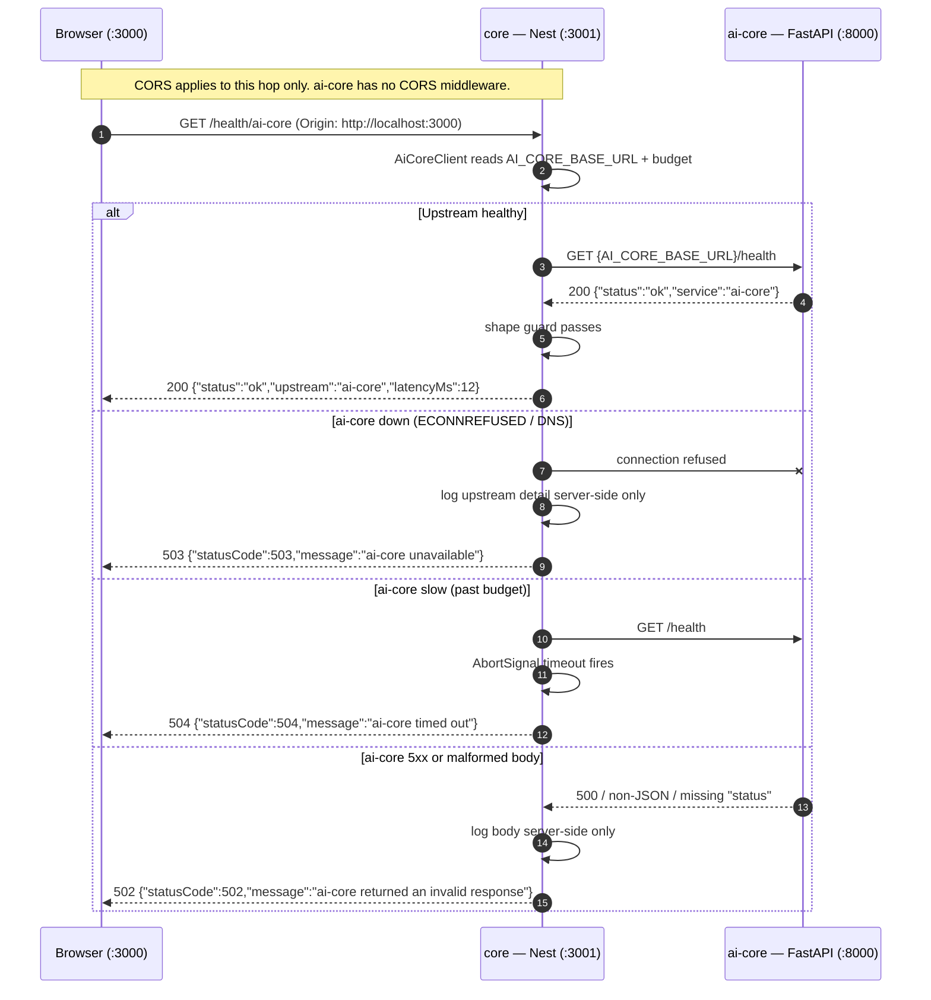

# Design: Scaffold backend services (`core`, `ai-core`)

Phase: `sdd-design` · Depends on: `proposal.md` (approved) · Date: 2026-08-22

The proposal closed six forks. This document closes the five it delegated: the `core -> ai-core`
contract, failure and timeout behavior, env naming and config loading, per-service directory
layout, and the boot story. Nothing here defines product or domain behavior.

## Technical approach

One browser-facing origin (`core`), one internal callee (`ai-core`), one file that knows the seam.
`AiCoreClient` is the only place in `core` that holds `AI_CORE_BASE_URL`, the wire format, the
timeout budget, and the upstream-to-HTTP error translation. Everything else in `core` depends on its
method signature, so the transport can be replaced without touching a caller.

**Fresh-clone rule (applies to both services):** every default needed to boot MUST be a literal in
code, not only in `.env`. `.env` overrides; it is never required. This is what makes
`git clone && install && run` work with no setup step.

## Architecture decisions

| # | Decision | Chosen | Rejected | Rationale |
|---|----------|--------|----------|-----------|
| D1 | Seam transport | Native `fetch` + `AbortSignal.timeout` | `@nestjs/axios` (axios + rxjs) | Node 24 ships both as stable globals. `@nestjs/axios` adds two runtime deps and an Observable/Promise interop seam to a scaffold with one call. |
| D2 | Client placement | `core/src/ai-core/ai-core.client.ts`, exported by `AiCoreModule` | Client inside `HealthModule`; a bare util function | A driven adapter with its own module is injectable, mockable in Jest, and stays the single owner of the upstream URL when product methods land. |
| D3 | Liveness vs dependency probe | `GET /health` has **no** upstream call; `GET /health/ai-core` exercises the client | One `/health` that also probes `ai-core` | A liveness probe that fails when a dependency is down causes cascading restarts under any orchestrator. Split them once, now, for free. |
| D4 | Probe route ownership | Both `/health*` routes live in `health/`; `HealthModule` imports `AiCoreModule` | `/health/ai-core` inside `ai-core/` | Routes stay discoverable by path prefix. `ai-core/` stays a pure outbound adapter with zero inbound HTTP surface. |
| D5 | Versioning posture | `/health*` permanently unversioned. Product routes reserve `core:/api/v1/*` and `ai-core:/v1/*`. No versioned route exists yet. | Version everything now; version nothing ever | A naming rule costs zero today and avoids a coordinated dual-deploy later. The two prefixes differ because the surfaces version independently. **Do not call `setGlobalPrefix('api')`** — it would move `/health` too. |
| D6 | Response validation | Hand-rolled shape guard in the client | `zod` / `class-validator` on the seam | One field is checked. Introduce a validation library when the first real payload lands — that is the trigger, not now. |
| D7 | Retries | None, on either route | Retry once on 5xx/timeout | AI calls are expensive and not proven idempotent. A blind retry doubles cost and latency and hides the failure. Revisit with idempotency keys. |
| D8 | `core` config | `@nestjs/config` `ConfigModule.forRoot({ isGlobal: true })` | Raw `process.env` | Nest does **not** read `.env` on its own; raw `process.env` would force `$env:` exports every PowerShell session. `ConfigModule` tolerates a missing `.env` and gives an injectable `ConfigService` that tests override. |
| D9 | `ai-core` config | `pydantic-settings` `BaseSettings(env_file=".env", extra="ignore")` in `app/config.py` | `os.environ`; `uv run --env-file .env` | Same deciding factor as D8: `os.environ` cannot read `.env`, and `uv run --env-file` hard-fails when the file is absent — which is the fresh-clone case. `BaseSettings` ignores a missing file. `extra="ignore"` means a future `OPENAI_API_KEY=` in `.env` will not crash boot before the field exists. |
| D10 | Architecture depth | Nest module-per-feature with exactly one hexagonal seam (`AiCoreClient`) | `domain/ application/ ports/ infrastructure/` + interface tokens | **This is where the line is.** Ports and adapters protect a domain; there is no domain yet. Add a port interface when a second driven adapter (database, second provider) or a domain rule with more than one caller appears. |
| D11 | Generated `Hello World!` triplet | Delete `app.controller.ts`, `app.service.ts`, `app.controller.spec.ts` | Keep them alongside `health/` | A public seam should not ship an unowned `GET /`. **Trap:** the generated `test/app.e2e-spec.ts` asserts `GET /` returns `Hello World!` — retarget it to `/health` in the same commit or e2e goes red. |
| D12 | `ai-core` layout | `/health` stays in flat `app/main.py`; no `routers/` package yet | Create `app/routers/health.py` now | Honors the proposal's "flat `app/main.py`". Create `app/routers/` when the second route lands. |

## Contract: `core -> ai-core`

Transport: HTTP/JSON over `AI_CORE_BASE_URL`. No envelope wrapper, no custom error schema — `core`
returns Nest's built-in `HttpException` body so nothing has to be authored or remembered.

| Route | Owner | Success body |
|-------|-------|--------------|
| `GET /health` | `ai-core` | `{"status":"ok","service":"ai-core"}` |
| `GET /health` | `core` | `{"status":"ok","service":"core"}` |
| `GET /health/ai-core` | `core` | `{"status":"ok","service":"core","upstream":"ai-core","latencyMs":12}` |

```ts
// core/src/ai-core/ai-core.types.ts — the whole seam, for now
export interface AiCoreHealth { status: 'ok'; service: 'ai-core' }

// core/src/ai-core/ai-core.client.ts
@Injectable()
export class AiCoreClient {
  checkHealth(): Promise<AiCoreHealth>; // throws the mapped HttpException below
}
```

Product methods are added to this class. Callers never import `fetch`, a URL, or a timeout.

## Error and timeout behavior

Two budgets, one env var:

| Budget | Value | Where | Justification |
|--------|-------|-------|---------------|
| Product / inference calls | `AI_CORE_TIMEOUT_MS=30000` | env, literal default in client | The proposal assumes inference completes in under 30 s. The timeout and the assumption are deliberately the **same number**: anything slower has violated the assumption and needs a job queue, so timing out there is the intended signal, not a tuning bug. |
| Health probe | `2000` ms, hardcoded constant | `ai-core.client.ts` | A probe exists to report reachability fast. Waiting out an inference budget to learn the port is closed is useless. Not an env var — it never varies by environment. |

Translation table. `core` **never** forwards the upstream body, upstream status text, or
`AI_CORE_BASE_URL` to the browser; that detail goes to the server log only. Decision #5's entire
point is that the browser cannot see `ai-core`.

| Upstream condition | Client throws | Browser sees | Body |
|--------------------|---------------|--------------|------|
| Connection refused / DNS failure | `ServiceUnavailableException` | **503** | `{"statusCode":503,"message":"ai-core unavailable"}` |
| `AbortSignal` fires past budget | `GatewayTimeoutException` | **504** | `{"statusCode":504,"message":"ai-core timed out"}` |
| Non-2xx from `ai-core` | `BadGatewayException` | **502** | `{"statusCode":502,"message":"ai-core returned an invalid response"}` |
| 2xx, non-JSON or shape mismatch | `BadGatewayException` | **502** | `{"statusCode":502,"message":"ai-core returned an invalid response"}` |

Collapsing these into `500` would destroy the frontend's ability to tell "retry later" (503/504)
from "there is a bug upstream" (502). That distinction is the only reason to keep three codes.

## Sequence: `frontend -> core -> ai-core`, with failure paths



## Environment and config

```ini
# apps/backend/core/.env.example
PORT=3001
CORS_ORIGIN=http://localhost:3000
AI_CORE_BASE_URL=http://127.0.0.1:8000
AI_CORE_TIMEOUT_MS=30000
```

```ini
# apps/backend/ai-core/.env.example
LOG_LEVEL=INFO
# Provider credentials belong here and ONLY here.
# core and the frontend must never hold them. None are required yet.
# OPENAI_API_KEY=
```

**`127.0.0.1`, not `localhost`, in `AI_CORE_BASE_URL`.** `fastapi dev` binds IPv4 `127.0.0.1`;
`localhost` on Windows can resolve to `::1` first. Node's happy-eyeballs usually recovers, but the
literal IP removes the class of failure for free.

`main.ts` keeps both literals so a fresh clone boots with no `.env`:

```ts
app.enableCors({ origin: process.env.CORS_ORIGIN ?? 'http://localhost:3000' });
await app.listen(Number(process.env.PORT ?? 3001)); // generated value was 3000 — decision #4
```

`ConfigModule` has already populated `process.env` by the time `main.ts` reaches these lines, so the
bootstrap edge stays a one-word diff from the generated file. Everything inside DI uses
`ConfigService` — that is what tests override.

## Directory structure

```
apps/backend/core/
├── src/
│   ├── main.ts                       # CORS + port literal 3001
│   ├── app.module.ts                 # ConfigModule (global) + HealthModule
│   ├── health/
│   │   ├── health.module.ts          # imports AiCoreModule
│   │   ├── health.controller.ts      # GET /health, GET /health/ai-core
│   │   └── health.controller.spec.ts
│   └── ai-core/
│       ├── ai-core.module.ts         # exports AiCoreClient
│       ├── ai-core.client.ts         # ONLY file that knows the upstream URL
│       ├── ai-core.client.spec.ts
│       └── ai-core.types.ts
├── test/app.e2e-spec.ts              # generated, RETARGETED to /health
├── .env.example  .gitignore  package.json  pnpm-lock.yaml

apps/backend/ai-core/
├── app/
│   ├── __init__.py
│   ├── config.py                     # Settings(BaseSettings)
│   └── main.py                       # FastAPI() + GET /health
├── tests/test_health.py              # NO __init__.py — see below
├── .env.example  .gitignore  .python-version  pyproject.toml  uv.lock
```

**pytest import trap.** `uv init` does not install the project, so `from app.main import app` fails
under pytest's default `prepend` import mode unless the service root is on `sys.path`. Fix it in
config, not with a stray `__init__.py`:

```toml
[tool.pytest.ini_options]
testpaths = ["tests"]
pythonpath = ["."]
```

## Boot and run (Windows / PowerShell)

First time only — `.env` copies are optional, the literals already default correctly:

```powershell
pnpm --dir apps/backend/core install
uv sync --directory apps/backend/ai-core
```

Three terminals. **No start ordering is required** — `core` has no boot-time dependency on
`ai-core`; the client is only invoked per request.

```powershell
pnpm --dir apps/frontend dev                                        # :3000
pnpm --dir apps/backend/core start:dev                              # :3001
uv run --directory apps/backend/ai-core fastapi dev app/main.py     # :8000
```

Verify — use `curl.exe`, because PowerShell aliases bare `curl` to `Invoke-WebRequest`:

```powershell
curl.exe http://127.0.0.1:8000/health          # ai-core direct
curl.exe http://localhost:3001/health          # core liveness
curl.exe http://localhost:3001/health/ai-core  # the seam, end to end
```

Stop `ai-core` and re-run the third command: it must return **503**, not hang and not 500.

## Frontend integration contract

Not implemented in this change — `apps/frontend` stays untouched. The rule it will follow:

- The frontend calls `core` only. It never holds `AI_CORE_BASE_URL` or any provider key.
- The first frontend call introduces `NEXT_PUBLIC_CORE_BASE_URL=http://localhost:3001` in
  `apps/frontend/.env.local`. `NEXT_PUBLIC_*` is browser-visible by design, which is fine for a base
  URL and is exactly why no credential may ever carry that prefix.
- CORS on `core` only matters for browser-side `fetch`. A Server Component or Route Handler calling
  `core` is server-to-server and never triggers it. `CORS_ORIGIN` still has to be right for the
  client-side case.

## File changes

| File | Action | Description |
|------|--------|-------------|
| `apps/Backend/` | Delete | Empty and untracked; same directory as `apps/backend` on this filesystem |
| `apps/backend/core/**` (generated) | Create | `nest new core --package-manager pnpm --skip-git` |
| `apps/backend/core/src/app.controller.ts`, `app.service.ts`, `app.controller.spec.ts` | Delete | D11 |
| `apps/backend/core/src/main.ts` | Modify | CORS + port literal 3001 |
| `apps/backend/core/src/app.module.ts` | Modify | Global `ConfigModule`, import `HealthModule` |
| `apps/backend/core/src/health/**`, `src/ai-core/**` | Create | D2, D3, D4 |
| `apps/backend/core/test/app.e2e-spec.ts` | Modify | Retarget `GET /` → `GET /health` (D11 trap) |
| `apps/backend/core/.env.example` | Create | 4 vars above |
| `apps/backend/ai-core/**` (generated) | Create | `uv init` with VCS init disabled, `uv python pin 3.12` |
| `apps/backend/ai-core/app/{config,main}.py`, `tests/test_health.py` | Create | D9, D12 |
| `apps/backend/ai-core/pyproject.toml` | Modify | deps, `requires-python`, `[tool.pytest.ini_options]` |
| `apps/backend/ai-core/.env.example` | Create | `LOG_LEVEL` + commented credential home |
| `.gitattributes` (root) | Create | Per proposal scope |
| `openspec/config.yaml` | Modify | Follow-up sync, per proposal scope |

## Testing strategy

| Layer | What | How |
|-------|------|-----|
| Unit — `core` | `HealthController` returns `{status:'ok',service:'core'}` | Jest. **Test-first**, this is the TDD gate for `core`. |
| Unit — `core` | `AiCoreClient` maps refused / timeout / non-2xx / malformed to 503 / 504 / 502 / 502 | Jest, stub global `fetch`. Four cases, one per row of the translation table. |
| Unit — `core` | Client never leaks upstream body or URL into the thrown message | Jest, assert on the exception body |
| E2E — `core` | `GET /health` responds 200 | Retargeted `test/app.e2e-spec.ts`, supertest |
| Unit — `ai-core` | `GET /health` returns `{status:'ok',service:'ai-core'}` | pytest + `TestClient` (needs `httpx`). **Test-first**, TDD gate for `ai-core`. |
| Cross-service | The seam end to end | Manual `curl.exe` checklist above. No automated cross-service test in this slice — booting two runtimes in CI is out of scope. |

## Threat matrix

The services execute no shell, spawn no subprocess, and automate no VCS or PR operation. One row is
applicable because the *scaffolders* touch VCS.

| Boundary | Applicability | Design response | Planned RED test |
|----------|---------------|-----------------|------------------|
| Documentation-like paths | N/A — no file classification or execution path exists | — | — |
| Git repository selection | **Applicable** — `nest new` and `uv init` git-init by default, creating nested repos the parent records as gitlinks, hiding all service source | Disable VCS init on both; delete any stray `.git` before staging | Not a unit test: a verification gate. `Get-ChildItem -Recurse -Force -Directory -Filter .git apps/backend` MUST return nothing before `git add`. |
| Commit state | N/A — no code stages, commits, or reads the index | — | — |
| Push state | N/A — no code pushes | — | — |
| PR commands | N/A — no PR automation | — | — |

## Migration / rollout

No migration. Nothing under `apps/` is tracked; rollback is `Remove-Item -Recurse -Force apps/backend`
pre-commit, `git revert` after. See the proposal's rollback section.

## Revisit if

Three proposal assumptions were resolved by `auto` mode. Each has a concrete tripwire here:

| Assumption | If it flips | Cost |
|------------|-------------|------|
| No token-by-token streaming | `core` must forward SSE/chunked. `AiCoreClient`'s `Promise<T>` return type is the wrong shape — it becomes `AsyncIterable`/`Observable`, and the 30 s budget becomes a per-chunk idle budget instead of a total one. | Rewrite of the client's transport and every caller signature. This is the priced cost of proxied topology; it does not invalidate D2 or D10. |
| `ai-core` under 30 s | `AI_CORE_TIMEOUT_MS` is not tunable past this — a longer ceiling means a job queue, a job id, and `GET /jobs/{id}`. Raising the number is the wrong fix and will look like the right one. | Architecture, not a scaffold. Stop and re-propose. |
| No auth, no persistence | Both land in `core`, not `ai-core`. Auth is a Nest guard in front of the product routes; persistence introduces the second driven adapter — which is the D10 trigger to add ports and adapters. | Additive. Nothing here blocks it. |

None of these makes the current design materially worse. The design is deliberately shaped so the
first two changes hit one file (`ai-core.client.ts`) plus its callers, and the third hits none.

## Open questions

- [ ] None blocking. The chained-PR decision (`#1 core`, then `#2 ai-core`) is still the
      orchestrator's to resolve before `sdd-apply` — it is a delivery question, not a design one.
